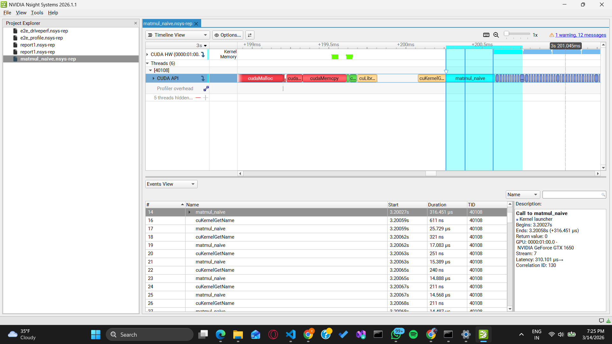

# cuda_matmul_optimizations
I have tried to optimize matrix multiplications as close as possible to cuBLAS

## 🔥 Highlights

- Achieved **~20× speedup** from naive to cuBLAS
- Improved performance from **88 → 1718 GFLOPS**
- Demonstrated memory-bound vs compute-bound behavior

## Sample Data
[Linked_in_Florian_post](https://www.linkedin.com/posts/florianmattana_your-gpu-matmul-benchmarks-might-be-one-of-activity-7437377427128864768-B6TC?utm_source=social_share_send&utm_medium=member_desktop_web&rcm=ACoAADd4dUUBlVJ-d3aJ3k1yH8AT53OIYIP0hCQ)
Refer this post which provides insight on data we use for benchamarks. Things like GPU caching will provide error results if all the elements in the matrix is '0' or '1'. So i have implemented a data generator where the matrix elements are 1 -> 2048^2 in a 2048x2048 matrix.

## ⚙️ Setup

GPU: NVIDIA GTX 1650  
Matrix Size: 2048 × 2048  
Precision: FP32  

---
## 🧪 Implementations

### 1️⃣ Naive CUDA Kernel
- Each thread computes one output element
- Direct global memory access
- No optimization

---

### 2️⃣ Memory Coalescing
- Improved memory access pattern
- Reduced global memory inefficiency

---

### 3️⃣ Shared Memory Tiling
- Loads tiles into shared memory
- Reuses data across threads
- Reduces global memory traffic

---

### 4️⃣ cuBLAS (Reference)
- NVIDIA’s highly optimized GEMM
- Uses advanced techniques:
  - Register tiling
  - Warp-level optimization
  - Instruction pipelining

---

## 📊 Performance Results

| Kernel        | Time (ms) | GFLOPS |
|--------------|----------|--------|
| Naive        | 195 ms   | 88     |
| Coalesced    | 69 ms    | 249    |
| Tiled        | 46 ms    | 373    |
| cuBLAS       | 10 ms    | 1718   |

---
## 🔬 Profiling

Nsight Systems was used to analyze execution timeline:

- Kernel launches
- GPU utilization
- Memory transfers

(See `images/Screenshot (540).png`)

---
## GPU Warmup
As we can see the first run of the kernel takes a lot of time compared to other iterations. This is due to a phenomenon called GPU Warmup. So I included a warmup kernel which executes for 5 runs before benchmarking the actual implementation. In order to maintain stable result each time we benchmark, I ran the kernel for 100 runs and took the cummulative time and divided it by 100 to get the average kernel runtime in ms.
## ❗ Why cuBLAS is faster?

Even optimized kernels are slower because cuBLAS uses:

- Register tiling
- Warp-level primitives
- Instruction pipelining
- Hardware-specific optimizations

## 🛠 Build & Run

### Compile

```bash
nvcc matmul_naive.cu -o .\exe\matmul_naive
nvcc matmul_coalesced.cu -o .\exe\matmul_coalesced
nvcc matmul_tiled.cu -o .\exe\matmul_tiled
nvcc matmul_cublas.cu -lcublas -o .\exe\matmul_cublas
